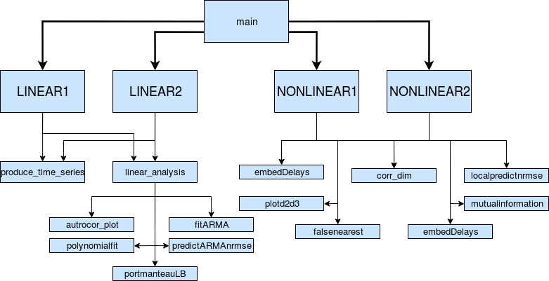

## Δομή της Εργασίας \& Τρόπος χρήσης
Η εργασία απαρτίζεται από πολλά κομμάτια. Έχουμε το κομμάτι των δεδομένων που βρίσκεται στο φάκελο data και αφορά τις χρονοσειρές που δίνονται για αυτή την εργασία. Παράλληλα δίνουμε και ένα script το οποίο κατεβάζει τις χρονοσειρές. Το κομμάτι της γραπτής αναφοράς βρίσκεται στον φάκελο doc. Τα δεδομένα που εξάγουμε από τις χρονοσειρές βρίσκονται στο φάκελο assets. Όλα τα αρχεία κώδικα βρίσκονται στο φάκελο src. Επιπλέον υπάρχει ο φάκελος kdtree όπου έχει τις βιβλιοθήκες που χρειάζονται για τη μη γραμμική ανάλυση.

Πιο συγκεκριμένα ο τρόπος με τον οποίο καλείται ο κώδικας στη matlab είναι ο εξής:
1. Ο χρήστης χρειάζεται απλά να ορίσει ως αρχική διαδρομή αρχείου τη διαδρομή αρχείου που βρίσκεται η εργασία.
2. Γράφει  `main`  στην κονσόλα.

Το σκριπτάκι main φροντίζει να καλέσει όλα τα υπόλοιπα αρχεία, ώστε να γίνουν όλες οι αναλύσεις. Τέλος όλα τα αποτελέσματα θα γραφούν στον φάκελος assets, διαγράφοντας όλα τα προηγούμενα.




### Ο κώδικας του αρχείου `main.m`:
```matlab
addpath('src');
addpath('kdtree');
addpath('kdtree/src');
addpath('kdtree/lib');
system('rm assets/*');
clear all;
close all;

%%%%%%%%%%%%%%%% FLAGS %%%%%%%%%%%%%%%%
BASIC_PLOT                      = true;
FIR                             = true;
EXTREMA_PLOT                    = true;
EXTREMA_SERIES_PLOT             = true;
REMOVES_TREND                   = true;
REMOVES_TREND_PLOT              = true;
AUTOCORR_PLOT                   = true;
AKAIKE                          = true;


SCATTER_DIAGRAMS_PLOT           = false;
DBSCAN_CLUSTERING               = false;
FALSE_NEAREST_CALC_PLOT         = true;
FIND_BEST_TAU                   = true;
CALCULATE_CORRELATION_DIMENSION = true;
PLOT_CORR_DIM                   = true;
TRAIN_LOCAL_MODEL               = true;
%%%%%%%%%%%%%%%% Input time Series & globals %%%%%%%%%%%%%%%%
LENGTH                          = 6000;
TEST_SET_LENGTH                 = 500;
POLORDER                        = 4;
MAX_ORDER_AR                    = 20;
MAX_ORDER_MA                    = 5;
fs                              = 100; % Hz
Ts                              = 1.0 / fs; % seconds

% read series
fileID1 = fopen('data/dat6v1.dat', 'r');
fileID2 = fopen('data/dat6v2.dat', 'r');
X1 = cell2mat(textscan(fileID1, '%f'));
X2 = cell2mat(textscan(fileID2, '%f'));
T = [1:LENGTH];


%%%%%%%%%%%%%%%% Time Series 1 %%%%%%%%%%%%%%%%
MAX_ORDER_AR                    = 20;
MAX_ORDER_MA                    = 5;
LINEAR1
% NONLINEAR1
%%%%%%%%%%%%%%%% Time Series 2 %%%%%%%%%%%%%%%%
MAX_ORDER_AR                    = 10;
MAX_ORDER_MA                    = 3;
% LINEAR2
% NONLINEAR2


%%%%%%%%%%%%%%%% auto crop all images %%%%%%%%%
% requires image magic
!mogrify -trim +repage assets/*.png
```

### Ο κώδικας του αρχείου `LINEAR1.m`:
```matlab
DST_NUM = '1st';
if(BASIC_PLOT)
    f = figure();
    plot(T, X1);
    saveas(f, sprintf('assets/basic_plot_%s.png', DST_NUM));
    title(sprintf('%s time series', DST_NUM));
    xlabel('time-step');
    ylabel('eye-position');
end
% see if the signal has information
% if voids and non-voids exist inside it
% then there is information.
% plot(T, log(abs(X1) + eps));
% Y1 = log(abs(X1(2:end))) - log(abs(X1(1:LENGTH-1)));
% plot(T(1:end-1), Y1)

filterorder = 10;
% we tested 30, 20, 10, 5
% 10 is much more promising...
nsam = 5;
timesep = 5;
% get EXTREMA SERIES 
[AMA, AMI, AMD, TMA, TMI, TBP] = produce_time_series(X1, Ts, filterorder, nsam, timesep, EXTREMA_PLOT, EXTREMA_SERIES_PLOT, FIR, DST_NUM);

% all linear analysis for AMA
linear_analysis(AMA, 'AMA1', MAX_ORDER_AR, MAX_ORDER_MA, POLORDER, ...
                EXTREMA_PLOT, EXTREMA_SERIES_PLOT, REMOVES_TREND, ...
                REMOVES_TREND_PLOT, AUTOCORR_PLOT, AKAIKE, DST_NUM);
                
% all linear analysis for TMI
linear_analysis(TMI, 'TMI1', MAX_ORDER_AR, MAX_ORDER_MA, POLORDER, ...
                EXTREMA_PLOT, EXTREMA_SERIES_PLOT, REMOVES_TREND, ... 
                REMOVES_TREND_PLOT, AUTOCORR_PLOT, AKAIKE, DST_NUM);
```
### Ο κώδικας του αρχείου `NONLINEAR1.m`:
```matlab
TS_NUM = '1st'; % '2nd'
xV = X1;

m_max = 5; % this is precalculated by seeing the various scatter plots

xM = embedDelays(xV, m_max, 2);
if(SCATTER_DIAGRAMS_PLOT)
  f = plotd2d3(xM(:,1:3), sprintf('Multi dimensional scatter-diagrams for % time series', TS_NUM));
  saveas(f, 'assets/scatter_xM_1-3.png');
  f = plotd2d3(xM(:,1:4), sprintf('Multi dimensional scatter-diagrams for % time series', TS_NUM));
  saveas(f, 'assets/scatter_xM_1_2_4.png');
  f = plotd2d3(xM, sprintf('Multi dimensional scatter-diagrams for % time series', TS_NUM));
  saveas(f, 'assets/scatter_xM_1_2_5.png');
end
% Noise is the same for every plot, so it is not corelated with the input time series
% it is white noise because n --> +infty => Normalized distribution of noise.
% Its deviation is the same through the sample time.
if(DBSCAN_CLUSTERING)
    epsilon=0.5;
    MinPts=10;
    IDX=DBSCAN(xM,epsilon,MinPts);

    %% Plot Results
    PlotClusterinResult(xM, IDX);
    title(['DBSCAN Clustering (\epsilon = ' num2str(epsilon) ', MinPts = ' num2str(MinPts) ')']);
end

% find best tau by using mutual information criterion
best_tau = 10;
if(FIND_BEST_TAU)
  tmax = 100;
  [mutM,f] = mutualinformation(xV, tmax);
  saveas(f, sprintf('assets/mutualinformation_%s.png', TS_NUM));
  best_tau = 10; % there is no local minimum so we choose a
                 % bending point
end
tau = best_tau;

xM = embedDelays(xV, m_max, tau);
if(SCATTER_DIAGRAMS_PLOT)
  m = 0;
  f = plotd2d3(xM(:,1:3), sprintf('scatter-diagrams (tau=%d) for %s time series', tau, TS_NUM));
  saveas(f, 'assets/scatter_with_tau_xM_1-3.png');
  % f = plotd2d3([xM(:,1) xM(:,4) xM(:,5)], sprintf('scatter-diagrams (tau=%d) for %s time series', tau, TS_NUM));
  % saveas(f, 'assets/scatter_with_tau_xM_1_4_5.png');    
end
if(FALSE_NEAREST_CALC_PLOT)
  [fnnM,mdistV,sddistV,f] = falsenearest(xV, tau, m_max);
  saveas(f, sprintf('false_neares_calc_plot_%s.png', TS_NUM));
end


best_m = 3; % because when 4th and 5th dimension entered it causes catastrophy

% calculate correlation dimension
if(CALCULATE_CORRELATION_DIMENSION)
  mmax = 7;
  [cor_dim,~,f] = corr_dim(xV, mmax, tau, PLOT_CORR_DIM);
  saveas(f, sprintf('assets/cor_dim_plot_%s.png', TS_NUM));
end


% train a local model
if(TRAIN_LOCAL_MODEL)
  k = 3; % stands for k in k-nn
  q = 1;
  Tmax = 10;
  [nrmseV,~,f] = localpredictnrmse(xV, TEST_SET_LENGTH, tau, best_m, Tmax, k, 1,'local-model-fit_1');
  saveas(f, sprintf('assets/local_model_fit_%s.png', TS_NUM));
end
```